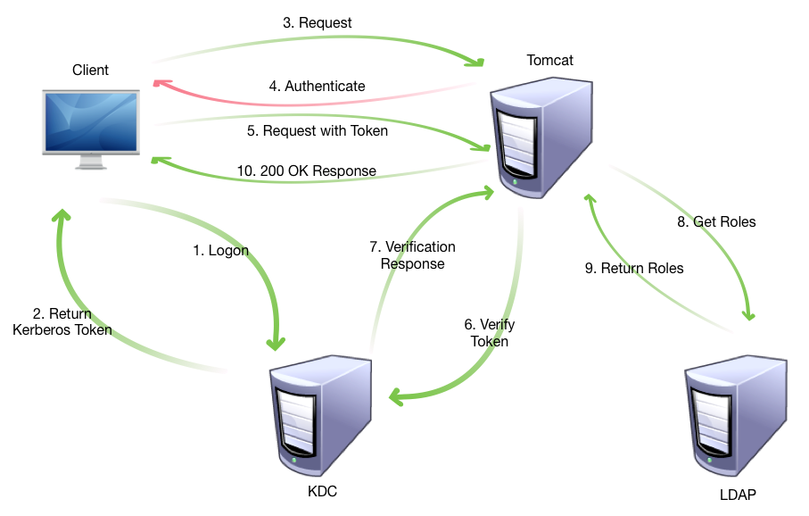
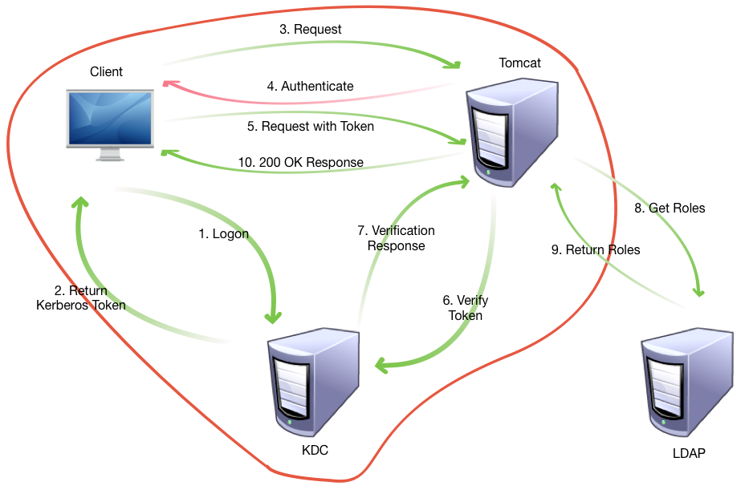
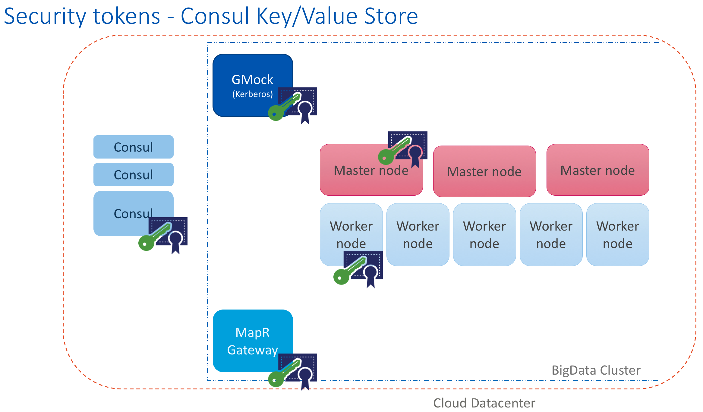
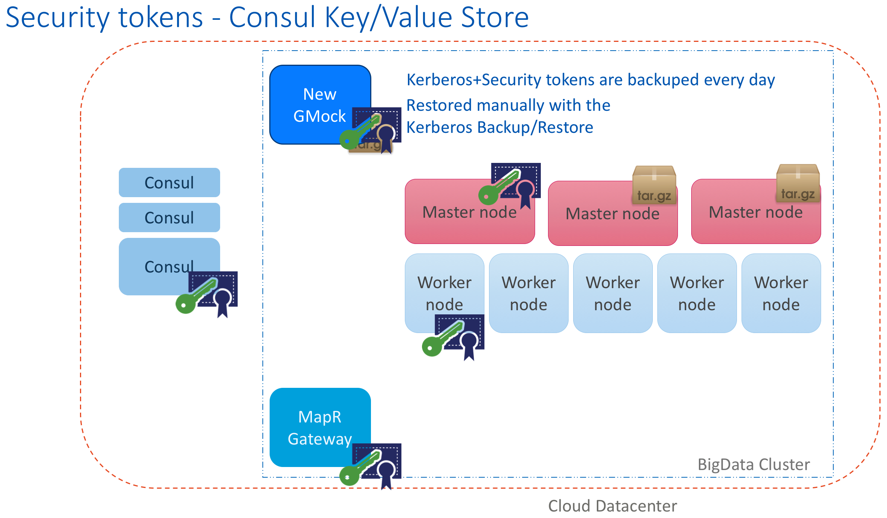
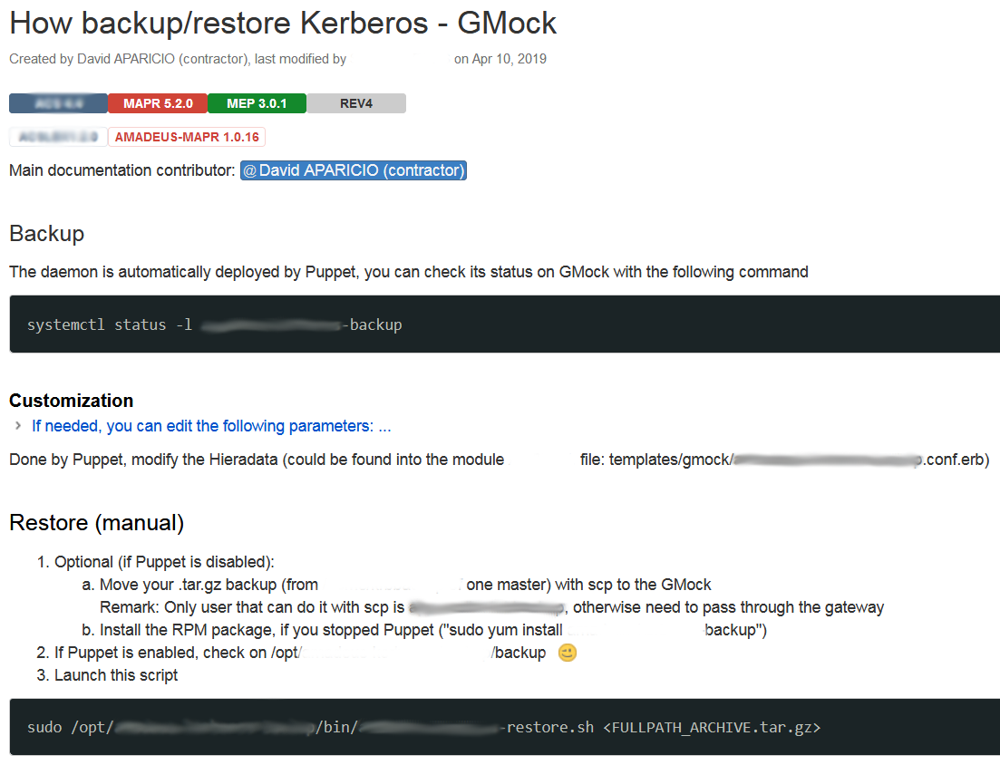
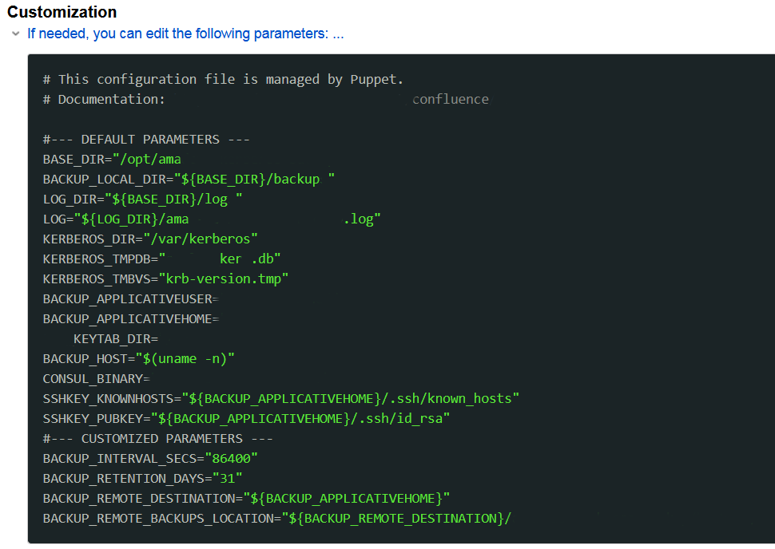
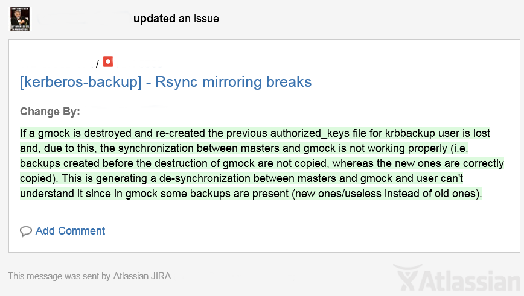
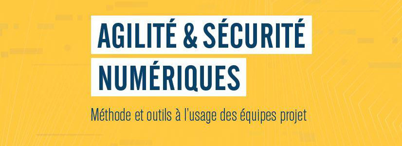

## Agilité et sécurité numériques: Cas concret avec la sauvegarde automatisée de Kerberos
[David Aparicio](https://david.aparicio.eu)

*DevOps Cloud and Bigdata*

###### 3ème édition Sophia Security Camp (08 Octobre 2019)
___
## Avant propos
<!-- .slide: data-background="#9a0007" data-transition="page" -->
L'ensemble de la présentation porte sur ma mission DevOps Bigdata ALTRAN chez AMADEUS

Les opinions sont les miennes et non les visions de mon ancien employeur, ni celles de mon employeur actuel
##### Disclaimer
___
## David Aparicio

Double diplôme INSA de Lyon / UNICAMP (Brésil)

Facebook Open Academy / MIT AppInventor

2 ans à AMADEUS

Nouveau job à Lyon

<!-- Curieux
* Transactional Memories
* Battery Profiling
* MIT AppInventor
* SMPC / BC -->
___
## Analogie
« Nul n'est censé ignorer la loi »
___
## Ma devise
« Nul développeur n'est censé ignorer la sécurité »
---
## Kerberos: kézako?

<!-- KDC = Key Distribution Center -->
Source (EN): [Kerberos pour les manageurs](https://dzone.com/articles/introduction-to-kerberos-for-managers)
___
## Authentification | Autorisation

Cours (EN): [6.858 Fall 2014 Lecture 13: Kerberos](https://youtu.be/bcWxLl8x33c)
---
## Contexte
Kerberos est un SPOF (Point individuel de défaillance)

Pas de ressource pour le rendre HA (Haute Disponibilité)

Vite fait & Bien fait
___
## Où stocker la sauvegarde ?
* HDFS 
alias Hadoop Distributed File System ?

<!--___
## Architecture
* GMock
* Master
* Worker
* Gateway
* Consul KV -->
___
## Architecture générale

___
## Résultat

---
## Sécurité
<!-- https://media.giphy.com/media/PmXwiamUkK5qjKPPaa/source.gif-->
<!-- .slide: data-background="/img/security_container.gif" data-transition="fade" -->
___
## [Modèle de menace](https://fr.wikipedia.org/wiki/Mod%C3%A8le_de_menace)
### [Threat model](https://en.wikipedia.org/wiki/Threat_model)
___
## [Single Source of Truth (SSOT)](https://en.wikipedia.org/wiki/Single_source_of_truth)
Puppet Master avec la gestion des certificats
---
## Documentation

___
## Configuration optionnelle

___
## Chaos Monkey

---
## Quelques problèmes
* Cluster sans Kerberos (MapR ticket)
* Pas de 50/50
* Temps de livraison
* Sécurité ?
* Accompagnement du Management
---
## Conclusion
___
## Infos à retenir
<!-- Key Takeaways-->
* Security by design
___
## Sécurité dans l'agilité
<!-- Key Takeaways-->
Pour [aller plus loin](https://www.ssi.gouv.fr/administration/guide/agilite-et-securite-numeriques-methode-et-outils-a-lusage-des-equipes-projet/):

* Atelier d'analyse de risque
* L'appréciation des risques
___
## Merci
Questions ?
___
## Keep in touch
<!-- https://media.giphy.com/media/NEvPzZ8bd1V4Y/source.gif" -->
Ceci fût ma 1ère présentation tech

*david@aparicio.eu*

<!--
trans: default/cube/page/concave/zoom/linear/fade/none
https://github.com/yusukebe/revealgo/blob/master/assets/templates/slide.html
https://t.co/3MgS9jX2Ky | http://i.giphy.com/90F8aUepslB84.gif -->